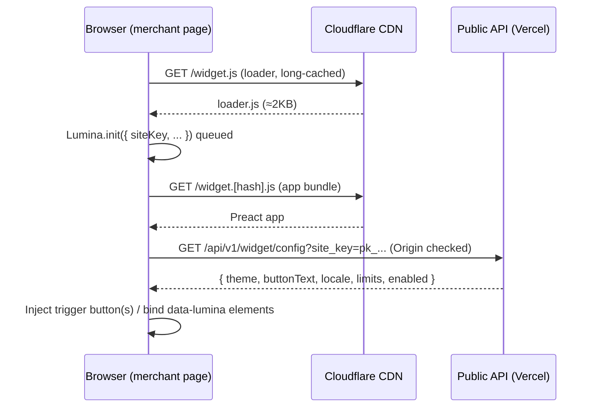
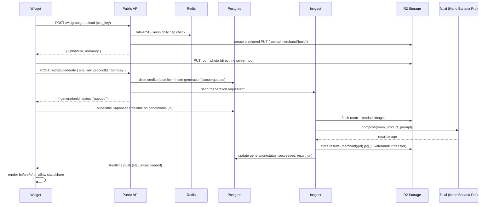

# LUMINA — Technical Architecture & Implementation Guide

**Version:** 1.0
**Status:** Build-ready (this is a decision document, not an evaluation)
**Author role:** Acting CTO / Staff Engineer
**Product:** LUMINA Spatial Engine — AI Visual Commerce ("Try in your room")

> This document makes final technical decisions. Where alternatives exist, one option is
> chosen and the rest are noted only as documented fallbacks behind an abstraction. The goal
> is to start development immediately with zero ambiguity.

---

## 0. What we are building (1 paragraph)

LUMINA lets any e‑commerce, showroom, or physical store add a **"Try in your room"** button to a
product. The shopper opens a modal, uploads or shoots a photo of their space, and an AI pipeline
composites the *specific* product into that space with realistic lighting, scale, shadows, and
perspective. The merchant integrates LUMINA by pasting **one line of script** — no Shopify/Woo/Magento
plugin. LUMINA is a **multi-tenant SaaS** with a merchant dashboard, credit-based billing, usage
metering, analytics, and an embeddable widget delivered from a global CDN.

The system is split into five planes:

1. **Widget plane** — the tiny embeddable client that runs on the merchant's site.
2. **Edge/API plane** — public widget API + authenticated merchant API.
3. **AI plane** — durable, queued image-generation workflow.
4. **Data plane** — Postgres (relational), object storage (images), Redis (rate limit/cache).
5. **Control plane** — dashboard, billing, observability.

---

## 1. System Architecture

### 1.1 Component map (text diagram)

```
                                   END SHOPPER'S BROWSER (merchant site)
                          ┌──────────────────────────────────────────────────┐
                          │  loader.js  ──async──▶  widget.[hash].js           │
                          │  (≈2KB)                 (Preact app in Shadow DOM) │
                          └───────────────┬──────────────────────┬────────────┘
                                          │  HTTPS (site_key)     │  Realtime (WSS)
                                          ▼                       ▼
              ┌───────────────────────────────────────────────────────────────────┐
              │                    CLOUDFLARE  (CDN + WAF + DDoS)                    │
              │   • serves /widget.js, /widget.[hash].js   • image delivery + resize │
              └───────────────┬───────────────────────────────────────┬────────────┘
                              │                                         │
        Public Widget API     ▼                                         ▼   Merchant Dashboard
   ┌───────────────────────────────────────┐               ┌──────────────────────────────────┐
   │  NEXT.JS (Vercel) — Route Handlers      │               │  NEXT.JS App Router (Vercel)      │
   │  /api/v1/widget/*                       │               │  app.lumina.app                   │
   │  • config  • sign-upload  • generate    │               │  • Supabase Auth (merchants)      │
   │  • status  • feedback                   │               │  • products / widget config       │
   │  site_key auth + Upstash rate limit     │               │  • credits / billing / analytics  │
   └──────────────┬─────────────────────┬────┘               └───────────────┬──────────────────┘
                  │ enqueue job          │ read/write                         │ read/write
                  ▼                      │                                    │
   ┌───────────────────────────┐        │                                    │
   │  INNGEST (durable workflow)│        │                                    │
   │  generation.requested      │        ▼                                    ▼
   │  step1 validate            │   ┌─────────────────────────────────────────────────────┐
   │  step2 (opt) bg-removal    │   │              SUPABASE  (Postgres + RLS)              │
   │  step3 scene analysis      │   │  merchants · api_keys · products · generations ·     │
   │  step4 compose (fal.ai)    │◀──┤  credit_ledger · usage_events · subscriptions ·      │
   │  step5 moderate+watermark  │   │  webhooks_inbox · audit_log                          │
   │  step6 store + finalize    │   │  Supabase Auth · Supabase Realtime (status push)     │
   └─────────┬─────────┬────────┘   └─────────────────────────────────────────────────────┘
             │         │ store images
             │         ▼
             │   ┌──────────────────────────┐        ┌───────────────────────────────────┐
             │   │  CLOUDFLARE R2 (S3 API)   │        │  UPSTASH REDIS                     │
             │   │  rooms/ products/ results/│        │  rate limits · idempotency ·       │
             │   └──────────────────────────┘        │  result cache · anon daily caps    │
             │                                        └───────────────────────────────────┘
             ▼  model calls (abstracted)
   ┌─────────────────────────────────────────────────────────────────────────────────────┐
   │   AI ORCHESTRATOR (internal lib)  ──▶  fal.ai gateway                                  │
   │   primary:  Gemini 3 Pro Image (Nano Banana Pro)   fast/cheap: FLUX.2 Edit / NB2       │
   │   fallbacks (same interface): Vertex AI · Replicate                                    │
   └─────────────────────────────────────────────────────────────────────────────────────┘

   CROSS-CUTTING:  Stripe (billing webhooks) · Resend (email) · Sentry (errors) · Axiom (logs/metrics)
```

### 1.2 Trust boundaries & multi-tenancy

- **Tenant = merchant.** Every row in every business table carries `merchant_id`. Isolation is enforced at
  three layers: (a) application (every query scoped by `merchant_id` from the authenticated context),
  (b) **Postgres Row-Level Security** on the dashboard path (Supabase Auth JWT carries the merchant claim),
  (c) **object-storage key prefixing** (`{merchant_id}/...`) so signed URLs cannot cross tenants.
- **Two auth domains:**
  - *Widget → Public API*: authenticated with a **publishable `site_key`** (like a Stripe publishable key),
    bound to an **allowed-domains list**. No user login. Server validates `Origin`/`Referer` + key + domain.
  - *Dashboard/Merchant API*: **Supabase Auth** session (JWT). Server-to-server uses a **secret key** (`sk_...`).
- **The widget never holds secrets.** It only ever sees the `site_key`, signed upload URLs, and a `generation_id`.

### 1.3 Sequence — widget load



### 1.4 Sequence — generation (async, the core)



---

## 2. Technology Stack (final decisions)

| Layer | Decision | Role | Why this and not the alternative |
|---|---|---|---|
| Monorepo | **Turborepo + pnpm workspaces** | One repo: widget, dashboard, api, shared packages | Shared TS types/validation between widget↔API↔dashboard; cached builds; single source of truth. |
| Language | **TypeScript (strict) everywhere**, Node 20+ | All code | One language across planes; types travel from DB → API → widget. |
| Widget UI | **Preact + Vite (library mode)**, rendered in **Shadow DOM** | Embeddable client | React-grade DX at ~3KB; Shadow DOM = zero CSS clashes with host sites. Vanilla TS would be cheaper but harder to maintain the modal/camera UX. |
| Widget delivery | **2-file loader pattern** (`loader.js` tiny + `widget.[hash].js`) on **Cloudflare CDN** | Install in 1 line, instant cache busting | Same pattern as Stripe/Intercom; loader is cached forever, app bundle is content-hashed. |
| Dashboard | **Next.js 15 (App Router) + Tailwind + shadcn/ui + Recharts**, on **Vercel** | Merchant control plane | Matches our stack; RSC + server actions; Recharts for analytics. |
| Public + merchant API | **Next.js Route Handlers** (Vercel Functions, Node runtime) | HTTP API for widget + dashboard | No second platform to operate; co-located with auth/DB; long-running work is offloaded to Inngest anyway. |
| Async/AI workflow | **Inngest** | Durable, retryable, concurrency-limited generation pipeline | The AI flow is multi-step with retries, idempotency, rate caps, and cost control — exactly Inngest's sweet spot. (QStash is the lighter fallback.) |
| Database | **Supabase Postgres** + **RLS**, schema/queries via **Drizzle ORM** | System of record + multi-tenancy | Postgres reliability; Drizzle for typed migrations/queries; Supabase for Auth/Realtime/Storage glue. |
| Merchant auth | **Supabase Auth** (email/password + Google OAuth) | Dashboard login, JWT for RLS | Batteries-included, integrates with Postgres RLS. |
| Widget auth | **Publishable `site_key`** + domain allowlist + **secret `sk_`** for S2S | Keyed, keyless-login access for the widget | Public-by-design key model; no user accounts on the storefront. |
| Image storage | **Cloudflare R2** (S3-compatible) | rooms / products / results | **Zero egress fees** — results are served & re-served constantly. S3 API = portable. |
| Image delivery/opt | **Cloudflare CDN + Image Resizing** | Fast, resized, cached image serving | Co-located with R2; on-the-fly resize/format (AVIF/WebP). |
| Real-time status | **Supabase Realtime** | Push generation status to widget | No polling; the widget subscribes to its own `generation` row. |
| Rate limit / cache | **Upstash Redis** (`@upstash/ratelimit`) | Abuse control, idempotency keys, result cache, anon daily caps | Serverless Redis; per-key + per-IP limits at the edge. |
| AI gateway | **fal.ai** (primary), abstracted behind an internal **AI Orchestrator** | Run/compose image models | One fast API, pay-per-use, easy model swap/fallback. Vertex AI / Replicate are drop-in alternates behind the same interface. |
| Primary AI model | **Gemini 3 Pro Image — "Nano Banana Pro"** (`gemini-3-pro-image-preview`) | Final hi-fi composite | Best multi-image blending + identity preservation; ~$0.039–0.134/image (1K–2K); 8–12s. |
| Fast/cheap AI model | **FLUX.2 [pro] Edit** (and/or **Nano Banana 2 Edit**) | Preview tier & cost lever | ~$0.03/MP / ~$0.06/image; faster/cheaper for high-volume or low-tier merchants. |
| Billing | **Stripe** (Billing + metered usage + Customer Portal) | Plans, credits, overages | Industry standard; webhooks drive entitlements. |
| Email | **Resend** + **React Email** | Transactional mail | Already in our stack; great DX for templated mail. |
| Errors | **Sentry** | Widget + dashboard + API + workflow errors | Cross-plane stack traces with release tagging. |
| Logs/metrics/events | **Axiom** | Structured logs + product/usage events at scale | Cheap high-volume ingestion; powers analytics + ops dashboards. |
| Uptime | **Better Stack** | Public-endpoint uptime + status page | Lightweight, status page for merchants. |
| Validation | **Zod** (shared package) | Runtime validation of all API I/O + widget config | Single schema reused on both sides of the wire. |
| Hosting summary | Vercel (app/API/Inngest) · Cloudflare (CDN/R2/WAF) · Supabase (DB/Auth/RT) · fal.ai (AI) · Stripe · Resend · Sentry/Axiom | — | Lean, serverless-first, minimal ops. |

**One rule that keeps us flexible:** every AI model call goes through the `AIOrchestrator` interface
(`compose(input): Promise<ComposeResult>`). Swapping fal.ai → Vertex AI → Replicate is a one-file change.

---

## 3. Widget Architecture & Public API

### 3.1 Design principles

1. **Tiny & non-blocking.** `loader.js` ≈ 2KB, loaded `async`. The app bundle (`widget.[hash].js`,
   target **< 45KB gzipped**) loads only when needed (on first trigger render or `init`).
2. **Zero collisions.** All UI lives inside a **Shadow DOM** root; styles are scoped, fonts inlined,
   z-index sandboxed. We never touch the host's global CSS or `window` (single namespace: `window.Lumina`).
3. **Async everything.** A command queue (`window.Lumina.q`) buffers calls made before the bundle loads
   (Segment/GA pattern), so `Lumina.init()` and `Lumina.open()` always "just work".
4. **Framework-agnostic.** Works on static HTML, Shopify Liquid, React, Vue, anything. No build step on
   the merchant side.
5. **Resilient & observable.** Network failures degrade gracefully; the widget emits events the merchant
   can hook into; errors are reported to Sentry with the merchant tag.

### 3.2 The 2-file loader pattern

```html
<!-- The single line a merchant pastes -->
<script async src="https://cdn.lumina.app/widget.js"
        data-site-key="pk_live_8f3a...">
</script>
```

`widget.js` (the loader) does three things: (1) reads `data-*` config, (2) creates the `window.Lumina`
queue stub if absent, (3) injects the content-hashed app bundle (`widget.a1b2c3.js`). The loader URL is
**immutable and cached for a year**; the app bundle is **content-hashed**, so deploys are instant and
safe (no merchant ever edits their HTML again).

### 3.3 Two ways to install

**A) Declarative (no JS) — recommended for non-technical merchants.**
Add the script (above), then mark any element as a trigger:

```html
<button data-lumina-trigger data-lumina-product="SKU-1234">Try in your room</button>
```

Any element (`<button>`, `<a>`, `<div>`) with `data-lumina-trigger` becomes a launcher. The widget auto-binds
on load and on DOM mutations (so it works with infinite scroll / SPA product grids).

**B) Programmatic — for developers / custom UX.**

```html
<script async src="https://cdn.lumina.app/widget.js"></script>
<script>
  window.Lumina = window.Lumina || { q: [] };
  Lumina.init({
    siteKey: "pk_live_8f3a...",
    locale: "it",
    theme: { accent: "#0F62FE", radius: 16, mode: "auto" },
    buttonText: "Provalo nella tua stanza",
  });

  document.querySelector("#try-btn").addEventListener("click", () => {
    Lumina.open({
      productId: "SKU-1234",
      // OR pass product data inline (no pre-registration needed):
      product: {
        name: "Lampada Aura",
        imageUrl: "https://shop.example.com/img/aura.png",
        category: "lighting"
      }
    });
  });
</script>
```

### 3.4 Public JavaScript API surface

| Method | Signature | Description |
|---|---|---|
| `Lumina.init` | `init(config: LuminaConfig): void` | Boots the widget, fetches remote config, binds declarative triggers. Idempotent. |
| `Lumina.open` | `open(opts: OpenOptions): Promise<void>` | Opens the modal for a product (by `productId` or inline `product`). |
| `Lumina.close` | `close(): void` | Closes the modal. |
| `Lumina.configure` | `configure(partial: Partial<LuminaConfig>): void` | Update theme/locale/text at runtime. |
| `Lumina.on` | `on(event, handler): () => void` | Subscribe to events; returns an unsubscribe fn. |
| `Lumina.off` | `off(event, handler): void` | Remove a handler. |
| `Lumina.preload` | `preload(): void` | Warm the bundle + remote config (e.g. on product hover). |
| `Lumina.version` | `version: string` | Loaded bundle version. |

**`LuminaConfig`**

```ts
interface LuminaConfig {
  siteKey: string;                 // required, pk_live_… / pk_test_…
  locale?: "it" | "en" | "de" | "fr" | "es";   // default: auto from <html lang> then "en"
  buttonText?: string;             // default text for auto-injected buttons
  theme?: {
    accent?: string;               // hex, drives buttons/links
    mode?: "light" | "dark" | "auto";
    radius?: number;               // px corner radius
    fontFamily?: string;           // CSS font stack; default uses host font
    zIndex?: number;               // modal stacking; default 2147483000
  };
  watermark?: boolean;             // forced on for free plan, configurable otherwise
  defaultProductSelector?: string; // CSS selector to auto-read product image/name from PDP
  onReady?: () => void;
}
```

**`OpenOptions`**

```ts
interface OpenOptions {
  productId?: string;              // references a product registered in the dashboard
  product?: {                      // OR inline (zero pre-registration)
    name: string;
    imageUrl: string;              // public URL of a clean product image
    category?: ProductCategory;    // furniture | lighting | door | window | kitchen | bath |
                                   // shower | tiles | mirror | decor | renovation | outdoor
    dimensions?: { w?: number; h?: number; d?: number; unit?: "cm" | "in" };
  };
  prefillRoomUrl?: string;         // optional: skip upload, use a known room image
  metadata?: Record<string, string>; // passed back in events/analytics (e.g. variant, page)
}
```

### 3.5 HTML data-attributes (declarative API)

| Attribute | On | Meaning |
|---|---|---|
| `data-site-key` | the `<script>` tag | Publishable key (alternative to `init({siteKey})`). |
| `data-lumina-trigger` | any element | Marks the element as a launcher. |
| `data-lumina-product` | trigger element | Product SKU/ID (dashboard-registered). |
| `data-lumina-product-name` | trigger element | Inline product name (if not registered). |
| `data-lumina-product-image` | trigger element | Inline product image URL. |
| `data-lumina-category` | trigger element | Product category hint for the AI. |
| `data-lumina-locale` | trigger element | Per-element locale override. |
| `data-lumina-mode` | the `<script>` tag | `auto` (default) \| `manual` (no auto-binding). |

### 3.6 Events & callbacks

All events are dispatched through `Lumina.on(event, handler)` **and** as `CustomEvent`s on `window`
(`lumina:<event>`), so merchants can hook either way (and GTM can listen on the DOM).

| Event | Payload | Fires when |
|---|---|---|
| `ready` | `{ version }` | Bundle loaded + config fetched. |
| `open` | `{ productId?, product?, metadata? }` | Modal opened. |
| `close` | `{ reason }` | Modal closed. |
| `upload:start` | `{ source: "file" \| "camera" }` | User begins providing a room photo. |
| `upload:done` | `{ roomKey }` | Room photo uploaded to storage. |
| `generate:start` | `{ generationId }` | Generation enqueued. |
| `generate:progress` | `{ generationId, stage }` | Pipeline stage updates. |
| `generate:success` | `{ generationId, resultUrl, beforeUrl }` | Composite ready. |
| `generate:error` | `{ generationId?, code, message }` | Pipeline/validation failure. |
| `result:save` | `{ generationId }` | User downloaded the result. |
| `result:share` | `{ generationId, channel }` | User shared the result. |
| `feedback` | `{ generationId, rating }` | User rated the result (👍/👎). |
| `cta:click` | `{ productId, metadata }` | User clicked the merchant CTA inside the result (e.g. "Add to cart"). |

> `cta:click`, `generate:success`, and `feedback` are the events merchants wire to their analytics and
> conversion tracking. This is how LUMINA proves ROI.

### 3.7 UI customization

- **Theme tokens** (`accent`, `mode`, `radius`, `fontFamily`, `zIndex`) are applied as CSS custom
  properties inside the Shadow root. No external stylesheet leaks in or out.
- **Copy & locale**: `buttonText`, plus a full i18n string table per `locale`; merchants can override
  any string via dashboard → Widget Settings.
- **Result CTA**: merchants can configure a post-result button ("Add to cart"/"Request a quote") whose
  click emits `cta:click` and can deep-link back to the PDP/cart.
- **Branding**: logo + "Powered by LUMINA" footer (removable on paid tiers; watermark on free tier).

### 3.8 Embed modes

1. **Button-injection** (declarative `data-lumina-trigger`).
2. **Custom trigger** (programmatic `Lumina.open()` from the merchant's own button).
3. **Inline/embedded** — render the experience inside a container instead of a modal:
   `Lumina.open({ productId, container: "#lumina-inline" })` (for PDPs that want it on-page).
4. **Auto-PDP** — with `defaultProductSelector`, the widget reads the product image+name straight from
   the page, so a merchant can deploy across an entire catalog with a single global button.

### 3.9 Security model (widget)

- `site_key` is public by design but **domain-bound**: the API rejects requests whose `Origin`/`Referer`
  isn't on the merchant's allowlist (and CORS is locked to those domains).
- **No secrets client-side.** Uploads use short-lived presigned URLs; results are short-lived signed URLs.
- **Abuse caps**: per-`site_key` rate limits + **per-anonymous-visitor daily generation caps** (cookie +
  IP hash in Redis) to stop credit-draining abuse.
- **CSP-friendly**: documented `script-src`, `connect-src`, `img-src` directives for strict-CSP merchants.

### 3.10 Real usage examples

**Static HTML / any site**

```html
<script async src="https://cdn.lumina.app/widget.js" data-site-key="pk_live_8f3a"></script>
<button data-lumina-trigger
        data-lumina-product-name="Poltrona Nube"
        data-lumina-product-image="https://shop.it/img/nube.png"
        data-lumina-category="furniture">
  Provalo nella tua stanza
</button>
```

**Shopify (Liquid, product template)**

```liquid
<button data-lumina-trigger
        data-lumina-product="{{ product.id }}"
        data-lumina-product-name="{{ product.title | escape }}"
        data-lumina-product-image="{{ product.featured_image | image_url: width: 1200 }}"
        data-lumina-category="{{ product.type | downcase }}">
  Try in your room
</button>
<!-- script added once in theme.liquid -->
```

**React storefront**

```tsx
import { useEffect } from "react";

export function TryInRoom({ sku, name, image }: Props) {
  useEffect(() => { window.Lumina?.preload?.(); }, []);
  return (
    <button
      onClick={() =>
        window.Lumina.open({ product: { name, imageUrl: image, category: "lighting" },
                             metadata: { sku } })
      }>
      Try in your room
    </button>
  );
}
// loader added once in app <head> with data-site-key
```

---

## 4. End-to-End Flow (every step)

### Phase A — Merchant onboarding (once)
1. Merchant signs up at `app.lumina.app` (Supabase Auth). A `merchant` row + a default `test` and `live`
   **API key pair** are created (`pk_test`/`sk_test`, `pk_live`/`sk_live`).
2. Merchant adds **allowed domains** (e.g. `shop.example.com`). These gate CORS + `Origin` checks.
3. Merchant either (a) registers products (CSV/API/manual) or (b) plans to pass products inline via
   data-attributes. Either path works.
4. Merchant configures the widget (button text, theme, locale, result CTA) and **copies the one-line
   script**. Onboarding checklist shows "Install detected ✅" once the first `widget/config` call arrives
   from an allowed domain.
5. Merchant picks a plan (Stripe Checkout). Credits are provisioned to the `credit_ledger`.

### Phase B — Widget load on the storefront
6. Browser loads `loader.js` (`async`, cached). Loader reads `data-site-key`, ensures `window.Lumina`
   queue, injects the content-hashed app bundle.
7. App bundle boots, mounts a Shadow DOM root, and calls `GET /api/v1/widget/config?site_key=…`.
   API validates the key + `Origin` (must be an allowed domain) and returns theme/locale/limits/enabled.
8. Widget binds all `data-lumina-trigger` elements (and observes the DOM for new ones). `ready` fires.

### Phase C — Shopper interaction
9. Shopper clicks a trigger → `open` fires → modal animates in (Shadow DOM, focus-trapped, mobile-first).
10. Modal step 1: **Provide a room photo** — drag/drop, file picker, or **camera capture** (`getUserMedia`
    with `capture` fallback on mobile). Client-side: validate type/size, **downscale to ≤ 2048px long edge**,
    EXIF-orient, compress to JPEG/WebP. `upload:start` fires.
11. Widget calls `POST /api/v1/widget/sign-upload` → receives a **presigned PUT URL** for
    `rooms/{merchant_id}/{uuid}.jpg`. Widget uploads the photo **directly to R2** (no server hop, fast,
    cheap). `upload:done` fires with `roomKey`.
12. Modal step 2: confirm product (already known from the trigger). Optional: shopper hints placement
    ("on the wall", "left of the sofa") via quick chips — passed as `placementHint`.
13. Shopper taps **Generate**. Widget calls `POST /api/v1/widget/generate { site_key, productId|product,
    roomKey, placementHint?, metadata? }`.

### Phase D — Server accepts the job
14. API revalidates key/domain + rate limits + **anonymous daily cap**. Resolves the product (registered
    or inline) and ensures the product image is fetched/cached to `products/{merchant_id}/…`.
15. API computes an **idempotency key** = `hash(merchant_id, productRef, roomKey, placementHint)` and
    checks Redis/`generations` for a recent identical result → if found, returns it instantly (free, 0 credits).
16. Otherwise API **atomically debits 1 credit** (transactional check-and-debit; if insufficient →
    `402 insufficient_credits`, widget shows an upgrade/contact message). Inserts a `generation` row
    (`status=queued`) and **sends `generation.requested`** to Inngest. Returns `{ generationId, status }`.
17. Widget subscribes to **Supabase Realtime** on that `generation` row (and falls back to polling
    `GET /widget/status/:id` if WS is blocked). Shows an animated "composing your room…" state.

### Phase E — AI workflow (Inngest, durable)
18. **Step 1 — Validate inputs.** Confirm both images are readable; classify the room image (is it
    plausibly an interior/space?) and the product image (clean subject?). Hard-fail early → refund credit.
19. **Step 2 — (optional) Product cutout.** If the product image has a busy background, run background
    removal to get a clean RGBA subject (improves compositing).
20. **Step 3 — (optional) Scene analysis.** A fast vision pass extracts lighting direction, color
    temperature, room style, and candidate placement surfaces → injected into the prompt for realism.
21. **Step 4 — Compose.** `AIOrchestrator.compose({ room, product, category, placementHint, scene })`
    calls **Nano Banana Pro** via fal.ai with the structured prompt (see §7). Concurrency + per-merchant
    rate limits enforced here. Automatic retry/backoff; on provider error, fallback model.
22. **Step 5 — Post-process.** Output moderation (safety), optional light upscale/sharpen, **watermark**
    if free tier, format to AVIF/WebP + JPEG fallback.
23. **Step 6 — Store & finalize.** Upload to `results/{merchant_id}/{generationId}.jpg`, write
    `generation(status=succeeded, result_url, cost_cents, model, latency_ms)`, emit a `usage_event`, and
    let Realtime push the update.
24. **On failure** after retries: `generation(status=failed, error_code)`, **refund the credit**, push
    error to the widget, report to Sentry.

### Phase F — Result & conversion
25. Widget receives the push, renders a **before/after** comparison (slider), with **Save** (download),
    **Share** (Web Share API / link), and the merchant's **result CTA** (e.g. "Add to cart") which emits
    `cta:click`. `generate:success` fires.
26. Shopper can 👍/👎 (`feedback`) and **regenerate** (variation) — each new generation debits a credit.
27. All events stream to Axiom; merchant dashboards aggregate impressions → generations → CTA clicks →
    (optionally) attributed conversions.

---

## 5. Database Schema

**Engine:** Postgres (Supabase). **Migrations/queries:** Drizzle ORM. **Isolation:** `merchant_id` on every
business table + RLS on the dashboard path. UUIDv7 (time-sortable) primary keys. All timestamps `timestamptz`.

### 5.1 ER overview (text)

```
auth.users (Supabase) 1───1 merchants 1───* memberships *───1 auth.users
merchants 1───* api_keys
merchants 1───* products
merchants 1───* widget_configs (1 active)
merchants 1───* generations *───0..1 products
merchants 1───* credit_ledger        (append-only; balance = SUM(amount))
merchants 1───* usage_events
merchants 1───1 subscriptions        (Stripe)
merchants 1───* webhooks_inbox        (idempotent webhook processing)
merchants 1───* audit_log
generations 1──* generation_assets    (room/product/result object refs)
```

### 5.2 Full DDL (Postgres)

```sql
-- =========================================================
-- ENUMS
-- =========================================================
create type product_category as enum (
  'furniture','lighting','door','window','kitchen','bath','shower',
  'tiles','mirror','decor','renovation','outdoor','fashion','other'
);
create type generation_status as enum ('queued','processing','succeeded','failed','refunded');
create type key_kind as enum ('publishable','secret');
create type key_env  as enum ('test','live');
create type member_role as enum ('owner','admin','member');
create type ledger_reason as enum ('purchase','grant','generation','refund','adjustment','expiry');
create type plan_tier as enum ('free','starter','growth','scale','enterprise');

-- =========================================================
-- TENANTS
-- =========================================================
create table merchants (
  id              uuid primary key default gen_random_uuid(),
  name            text not null,
  slug            text unique not null,
  plan            plan_tier not null default 'free',
  credits_balance integer not null default 0,            -- denormalized cache of ledger sum
  allowed_domains text[] not null default '{}',          -- e.g. {shop.example.com}
  settings        jsonb not null default '{}',           -- misc flags
  created_at      timestamptz not null default now(),
  updated_at      timestamptz not null default now()
);

create table memberships (
  id          uuid primary key default gen_random_uuid(),
  merchant_id uuid not null references merchants(id) on delete cascade,
  user_id     uuid not null references auth.users(id) on delete cascade,
  role        member_role not null default 'owner',
  created_at  timestamptz not null default now(),
  unique (merchant_id, user_id)
);

-- =========================================================
-- API KEYS  (only a hash is stored; raw key shown once)
-- =========================================================
create table api_keys (
  id           uuid primary key default gen_random_uuid(),
  merchant_id  uuid not null references merchants(id) on delete cascade,
  kind         key_kind not null,
  env          key_env  not null,
  prefix       text not null,            -- e.g. 'pk_live_8f3a' (for display/lookup)
  key_hash     text not null,            -- sha256 of full key
  last_used_at timestamptz,
  revoked_at   timestamptz,
  created_at   timestamptz not null default now()
);
create index api_keys_merchant_idx on api_keys (merchant_id);
create unique index api_keys_prefix_uidx on api_keys (prefix);

-- =========================================================
-- PRODUCTS
-- =========================================================
create table products (
  id              uuid primary key default gen_random_uuid(),
  merchant_id     uuid not null references merchants(id) on delete cascade,
  external_id     text,                  -- merchant SKU / platform product id
  name            text not null,
  category        product_category not null default 'other',
  image_url       text not null,         -- source image (we cache a clean copy)
  clean_image_key text,                  -- R2 key of background-removed copy (if produced)
  dimensions      jsonb,                 -- { w, h, d, unit }
  attributes      jsonb not null default '{}',
  active          boolean not null default true,
  created_at      timestamptz not null default now(),
  updated_at      timestamptz not null default now(),
  unique (merchant_id, external_id)
);
create index products_merchant_idx on products (merchant_id);
create index products_category_idx on products (merchant_id, category);

-- =========================================================
-- WIDGET CONFIG  (1 active per merchant; versioned)
-- =========================================================
create table widget_configs (
  id           uuid primary key default gen_random_uuid(),
  merchant_id  uuid not null references merchants(id) on delete cascade,
  is_active    boolean not null default true,
  button_text  text not null default 'Try in your room',
  locale       text not null default 'en',
  theme        jsonb not null default '{}',     -- { accent, mode, radius, fontFamily, zIndex }
  i18n         jsonb not null default '{}',     -- string overrides
  result_cta   jsonb,                           -- { label, urlTemplate }
  watermark    boolean not null default true,
  created_at   timestamptz not null default now()
);
create unique index widget_active_uidx on widget_configs (merchant_id) where is_active;

-- =========================================================
-- GENERATIONS  (the core fact table)
-- =========================================================
create table generations (
  id              uuid primary key default gen_random_uuid(),
  merchant_id     uuid not null references merchants(id) on delete cascade,
  product_id      uuid references products(id) on delete set null,
  status          generation_status not null default 'queued',
  -- inputs
  room_key        text not null,                 -- R2 key of uploaded room photo
  product_snapshot jsonb not null,               -- name/category/image used (inline-safe)
  placement_hint  text,
  idempotency_key text not null,
  -- outputs
  result_key      text,                          -- R2 key of composite
  model           text,                          -- 'nano-banana-pro' | 'flux2-edit' | ...
  -- accounting / ops
  credits_spent   integer not null default 1,
  cost_cents      integer,                       -- our provider cost (for margin analysis)
  latency_ms      integer,
  error_code      text,
  anon_id         text,                          -- hashed visitor id (abuse analytics)
  page_url        text,
  metadata        jsonb not null default '{}',
  created_at      timestamptz not null default now(),
  finished_at     timestamptz
);
create index gen_merchant_created_idx on generations (merchant_id, created_at desc);
create index gen_status_idx on generations (status);
create unique index gen_idem_uidx on generations (merchant_id, idempotency_key);
create index gen_product_idx on generations (product_id);

create table generation_assets (
  id            uuid primary key default gen_random_uuid(),
  generation_id uuid not null references generations(id) on delete cascade,
  role          text not null,                  -- 'room' | 'product' | 'result' | 'intermediate'
  storage_key   text not null,
  width         integer,
  height        integer,
  bytes         integer,
  created_at    timestamptz not null default now()
);
create index gen_assets_gen_idx on generation_assets (generation_id);

-- =========================================================
-- CREDITS  (append-only ledger; balance = SUM(amount))
-- =========================================================
create table credit_ledger (
  id            uuid primary key default gen_random_uuid(),
  merchant_id   uuid not null references merchants(id) on delete cascade,
  amount        integer not null,               -- +grant/+purchase, -generation, +refund
  reason        ledger_reason not null,
  generation_id uuid references generations(id) on delete set null,
  stripe_ref    text,
  note          text,
  created_at    timestamptz not null default now()
);
create index ledger_merchant_idx on credit_ledger (merchant_id, created_at desc);

-- Atomic, race-safe debit used by the API before enqueuing a job.
create or replace function debit_credits(p_merchant uuid, p_amount int, p_gen uuid)
returns integer language plpgsql as $$
declare new_balance int;
begin
  update merchants
     set credits_balance = credits_balance - p_amount,
         updated_at = now()
   where id = p_merchant and credits_balance >= p_amount
   returning credits_balance into new_balance;
  if new_balance is null then
    raise exception 'INSUFFICIENT_CREDITS' using errcode = 'P0001';
  end if;
  insert into credit_ledger(merchant_id, amount, reason, generation_id)
  values (p_merchant, -p_amount, 'generation', p_gen);
  return new_balance;
end $$;

-- =========================================================
-- USAGE / ANALYTICS EVENTS  (hot path mirrored to Axiom)
-- =========================================================
create table usage_events (
  id          uuid primary key default gen_random_uuid(),
  merchant_id uuid not null references merchants(id) on delete cascade,
  type        text not null,                    -- impression|open|upload|generate|success|cta|feedback
  product_id  uuid references products(id) on delete set null,
  generation_id uuid references generations(id) on delete set null,
  anon_id     text,
  props       jsonb not null default '{}',
  created_at  timestamptz not null default now()
);
create index usage_merchant_type_time_idx on usage_events (merchant_id, type, created_at desc);

-- =========================================================
-- BILLING
-- =========================================================
create table subscriptions (
  merchant_id          uuid primary key references merchants(id) on delete cascade,
  stripe_customer_id   text not null,
  stripe_subscription_id text,
  plan                 plan_tier not null default 'free',
  status               text not null default 'active',  -- active|past_due|canceled|trialing
  included_credits     integer not null default 0,      -- monthly allotment
  overage_meter        text,                             -- stripe meter id for usage billing
  current_period_end   timestamptz,
  created_at           timestamptz not null default now(),
  updated_at           timestamptz not null default now()
);

create table webhooks_inbox (
  id           text primary key,                 -- provider event id (idempotency)
  source       text not null,                    -- 'stripe' | 'fal'
  payload      jsonb not null,
  processed_at timestamptz,
  created_at   timestamptz not null default now()
);

create table audit_log (
  id          uuid primary key default gen_random_uuid(),
  merchant_id uuid references merchants(id) on delete cascade,
  actor       text,                              -- user id or 'system'
  action      text not null,
  target      text,
  meta        jsonb not null default '{}',
  created_at  timestamptz not null default now()
);
create index audit_merchant_idx on audit_log (merchant_id, created_at desc);
```

### 5.3 Row-Level Security (dashboard path)

```sql
alter table merchants       enable row level security;
alter table products        enable row level security;
alter table generations     enable row level security;
alter table credit_ledger   enable row level security;
alter table usage_events    enable row level security;
alter table widget_configs  enable row level security;

-- Helper: current user's merchant ids via memberships
create or replace function current_merchant_ids() returns setof uuid
language sql stable as $$
  select merchant_id from memberships where user_id = auth.uid()
$$;

-- Example policy (repeat per table, adjusting target):
create policy tenant_read on products for select
  using (merchant_id in (select current_merchant_ids()));
create policy tenant_write on products for all
  using (merchant_id in (select current_merchant_ids()))
  with check (merchant_id in (select current_merchant_ids()));
```

> The **public widget API** does NOT use end-user JWTs; it runs with a service role and scopes every query
> by the `merchant_id` resolved from the validated `site_key`. RLS is the safety net for the dashboard and
> any client-side Supabase access.

### 5.4 Indexing & multi-tenancy notes
- Every hot query is `merchant_id`-leading (`(merchant_id, created_at desc)`), keeping tenants' data
  physically clustered for fast pagination.
- `gen_idem_uidx` enforces idempotency: identical (merchant, inputs) cannot create duplicate paid jobs.
- `usage_events` is the high-volume table; partition by month (`PARTITION BY RANGE (created_at)`) once
  volume warrants, and roll old partitions to cold storage. Axiom holds the long-tail analytics.

---

## 6. API Reference

### 6.1 Conventions
- **Base URLs:** Public widget API `https://api.lumina.app/v1/widget/*`; Merchant API
  `https://api.lumina.app/v1/*` (same Vercel app, separated by auth + CORS policy).
- **Auth types:**
  - `PUBLISHABLE` — `site_key` (`pk_…`) sent as `?site_key=` or `X-Lumina-Key` header; **Origin-checked**,
    CORS limited to allowed domains. Read-mostly + generate.
  - `SECRET` — `Authorization: Bearer sk_…` for server-to-server (product import, etc.).
  - `SESSION` — Supabase Auth JWT for dashboard/merchant endpoints.
- **Versioning:** URL-versioned (`/v1`). Breaking changes → `/v2`; widget pins its compatible version.
- **Errors:** JSON `{ "error": { "code": "snake_case", "message": "...", "requestId": "..." } }` with proper
  HTTP status. Standard codes: `invalid_key`, `domain_not_allowed`, `rate_limited`, `insufficient_credits`,
  `invalid_input`, `unsupported_image`, `generation_failed`, `not_found`.
- **Idempotency:** mutating endpoints accept `Idempotency-Key` header.

### 6.2 Public Widget API (`PUBLISHABLE`)

| Method | Path | Auth | Payload | Response |
|---|---|---|---|---|
| GET | `/v1/widget/config` | publishable | `?site_key` | `{ enabled, theme, buttonText, locale, i18n, watermark, limits, resultCta }` |
| POST | `/v1/widget/sign-upload` | publishable | `{ contentType, kind:"room" }` | `{ uploadUrl, roomKey, expiresIn }` (presigned PUT to R2) |
| POST | `/v1/widget/generate` | publishable | `{ productId? , product?, roomKey, placementHint?, anonId, pageUrl?, metadata? }` | `201 { generationId, status:"queued" }` · `402 insufficient_credits` |
| GET | `/v1/widget/status/:id` | publishable | — | `{ id, status, stage?, resultUrl?, beforeUrl?, error? }` (polling fallback) |
| POST | `/v1/widget/feedback` | publishable | `{ generationId, rating:"up"\|"down", comment? }` | `204` |
| POST | `/v1/widget/event` | publishable | `{ type, productId?, generationId?, anonId, props? }` | `204` (impression/open/cta beacons) |

**`POST /v1/widget/generate` — example**

```http
POST /v1/widget/generate
X-Lumina-Key: pk_live_8f3a...
Origin: https://shop.example.com
Content-Type: application/json

{
  "product": { "name": "Lampada Aura", "imageUrl": "https://shop.example.com/img/aura.png",
               "category": "lighting" },
  "roomKey": "rooms/9f.../a1b2.jpg",
  "placementHint": "on the side table left of the sofa",
  "anonId": "v_7d2c...",
  "pageUrl": "https://shop.example.com/products/aura",
  "metadata": { "variant": "brass" }
}
```
```json
// 201 Created
{ "generationId": "0192f5...", "status": "queued" }
```

### 6.3 Merchant / Dashboard API (`SESSION`, some `SECRET`)

**Auth & account**
| Method | Path | Auth | Notes |
|---|---|---|---|
| POST | `/v1/auth/register` | — | Handled by Supabase Auth; creates merchant + default keys. |
| POST | `/v1/auth/login` / `/logout` | — / session | Supabase Auth. |
| GET | `/v1/me` | session | Current user + merchant(s) + role. |

**API keys**
| Method | Path | Auth | Payload → Response |
|---|---|---|---|
| GET | `/v1/keys` | session | → `[{ id, kind, env, prefix, lastUsedAt, revokedAt }]` |
| POST | `/v1/keys` | session | `{ kind, env }` → `{ id, key }` (**raw shown once**) |
| DELETE | `/v1/keys/:id` | session | revoke → `204` |

**Domains & widget config**
| Method | Path | Auth | Payload → Response |
|---|---|---|---|
| GET/PUT | `/v1/domains` | session | `{ domains: string[] }` |
| GET | `/v1/widget-config` | session | → active config |
| PUT | `/v1/widget-config` | session | `{ buttonText, locale, theme, i18n, resultCta, watermark }` → config |

**Products**
| Method | Path | Auth | Payload → Response |
|---|---|---|---|
| GET | `/v1/products` | session | `?cursor&category&q` → paginated list |
| POST | `/v1/products` | session/secret | `{ externalId?, name, category, imageUrl, dimensions? }` → product |
| POST | `/v1/products/bulk` | session/secret | `{ items: Product[] }` (CSV/feed import) → `{ created, failed }` |
| PUT/DELETE | `/v1/products/:id` | session/secret | update / soft-delete |

**Generations & analytics**
| Method | Path | Auth | Payload → Response |
|---|---|---|---|
| GET | `/v1/generations` | session | `?cursor&status&from&to&productId` → list (room/result thumbs) |
| GET | `/v1/generations/:id` | session | → full detail + assets + feedback |
| GET | `/v1/analytics/summary` | session | `?from&to` → `{ impressions, opens, generations, successRate, ctaClicks, topProducts[] }` |
| GET | `/v1/analytics/timeseries` | session | `?metric&interval&from&to` → series (feeds Recharts) |

**Credits & billing**
| Method | Path | Auth | Payload → Response |
|---|---|---|---|
| GET | `/v1/credits` | session | → `{ balance, ledger: [...] }` |
| GET | `/v1/billing/plans` | session | → plans + prices |
| POST | `/v1/billing/checkout` | session | `{ plan }` → `{ checkoutUrl }` (Stripe) |
| POST | `/v1/billing/portal` | session | → `{ portalUrl }` (Stripe Customer Portal) |

**Webhooks (no app auth; signature-verified)**
| Method | Path | Source | Action |
|---|---|---|---|
| POST | `/v1/webhooks/stripe` | Stripe (sig) | sub created/updated/canceled, invoice paid → grant/adjust credits, set plan; idempotent via `webhooks_inbox`. |
| POST | `/v1/webhooks/fal` | fal.ai (sig) | (optional) async job callbacks if not using polling inside Inngest. |

### 6.4 Internal (not public)
- `POST /internal/inngest` — Inngest function endpoint (signed).
- Health: `GET /healthz`, `GET /readyz`.

---

## 7. AI Pipeline

### 7.1 Goal & hard constraints
- **Input:** a shopper's room photo + a specific product image (+ category + optional placement hint).
- **Output:** the *same* product, realistically integrated into *that* room — correct scale, perspective,
  contact shadows, and matching light temperature. The product must remain **identity-faithful** (it's a
  real SKU the shopper may buy), not a "similar-looking" reinterpretation.
- **Budget triangle:** quality ≥ believable on a phone screen; latency target **p50 < 12s, p95 < 25s**;
  cost target **< $0.10 / generation** at retail, ideally **~$0.04–0.06**.

### 7.2 Model decisions (final)

| Role | Model | Access | Cost (approx, mid-2026) | Why |
|---|---|---|---|---|
| **Primary composite** | **Gemini 3 Pro Image — "Nano Banana Pro"** (`gemini-3-pro-image-preview`) | **fal.ai** (primary) / Vertex AI (direct fallback) | ~$0.039 (≤1K) – $0.134 (2K) per image; 8–12s | Best multi-image blending + **identity preservation across subjects**; designed for ecommerce composites; strong lighting/shadow realism. |
| **Fast / cheap tier** | **FLUX.2 [pro] Edit** (alt: **Nano Banana 2 Edit**) | fal.ai | ~$0.03/MP (FLUX.2) · ~$0.06/img (NB2) | Lower cost & latency for previews, free-tier merchants, and high-volume catalogs. Multi-reference editing, JSON prompts. |
| **Background removal** (opt) | fal background-removal (RMBG-class) | fal.ai | ~$0.001–0.01/img | Clean product cutout when source has busy background. |
| **Scene analysis** (opt) | Gemini 3 Flash (vision) | fal.ai / Vertex | fractions of a cent | Extract lighting/style/surfaces → richer prompt; cheap. |
| **Moderation** | provider safety + lightweight classifier | fal.ai / in-house | ~$0 | Block unsafe inputs/outputs. |

> **Abstraction:** all of the above sit behind `AIOrchestrator`. Routing (primary vs fast) is a per-merchant,
> per-request **policy** (`quality` | `balanced` | `fast`), so we can dial cost/quality without code changes
> and fail over between providers automatically.

### 7.3 Pipeline (v1 ships first; v2 is the realism upgrade)

```
            ┌─────────────────────────────────────────────────────────────┐
  v1 (MVP)  │  validate ─▶ compose(Nano Banana Pro) ─▶ moderate ─▶ store    │   single model call
            └─────────────────────────────────────────────────────────────┘

            ┌───────────────────────────────────────────────────────────────────────────┐
  v2        │ validate ─▶ [bg-removal] ─▶ scene-analysis ─▶ compose ─▶ [upscale] ─▶        │
  (quality) │            ─▶ moderate+watermark ─▶ store                                    │
            └───────────────────────────────────────────────────────────────────────────┘
```

Each box is an **Inngest step** (independently retried, cached, timed). Steps marked `[ ]` are optional and
gated by category/policy (e.g. background removal only when the product image isn't already clean; upscale
only for `quality` policy or paid tiers).

### 7.4 Call order & orchestration rules
1. **Validate** (fail fast, refund on hard fail). Reject non-interior room shots, corrupt files,
   disallowed content.
2. **Cutout** product if needed (RGBA), else pass the registered `clean_image_key`.
3. **Scene analysis** (one Flash call) → `{ lightDir, colorTempK, style, surfaces[] }`.
4. **Compose** with the structured prompt (below) + both images. **Concurrency cap per merchant** and a
   global cap protect provider rate limits and our budget. Retry 2× with backoff; then **fallback model**.
5. **Moderate** output; **watermark** if free tier; transcode (AVIF + JPEG fallback) via Cloudflare.
6. **Persist** + record `cost_cents`, `latency_ms`, `model` for margin and quality dashboards.

### 7.5 The compose prompt (template)

Nano Banana Pro takes the **room image + product image** plus this instruction. Keep it deterministic and
identity-preserving:

```
ROLE: You are a photorealistic interior compositor.
TASK: Insert the PRODUCT (second image) into the ROOM (first image) so it looks like a real
photograph of that room containing that exact product.

HARD RULES:
- Preserve the product's exact geometry, materials, colors, proportions, and branding. Do NOT
  redesign, restyle, or invent a different product.
- Do NOT alter the room's architecture, walls, windows, existing furniture, or camera angle.
- Place the product {PLACEMENT_HINT or "in the most natural, functional location for its category"}.
- Match scale to real-world dimensions {DIMENSIONS if provided} relative to visible references
  (doors ≈ 200cm, sofas, ceiling height).
- Match the room's lighting: direction {scene.lightDir}, color temperature {scene.colorTempK}K.
  Add physically correct **contact shadows** and soft ambient occlusion where the product meets
  surfaces.
- Respect occlusion: existing objects in front of the placement must overlap the product correctly.
- Output a single, clean, high-resolution photo. No text, no watermark, no UI, no borders.

CATEGORY GUIDANCE: {category-specific note}
  // lighting: emit a believable glow/cast if switched on; respect fixture mounting.
  // tiles/renovation: apply as a surface replacement following the room's perspective grid.
  // door/window: align to existing openings and wall thickness.
  // mirror: reflect a plausible portion of the actual room.
QUALITY: photorealistic, natural depth of field consistent with the room photo.
```

A negative/secondary guard is sent where the model supports it: *"avoid: cartoonish look, duplicated
product, floating object, mismatched lighting, distorted proportions, changed product color."*

### 7.6 Input & output validation
- **Pre:** MIME/type/size; min resolution; interior-likelihood + product-likelihood checks; strip EXIF/GPS;
  reject faces-dominant images for non-fashion categories (privacy).
- **Post:** safety moderation; "did the product actually appear?" sanity check (cheap vision verify on
  `quality` policy); reject + retry if the model returned the room unchanged or a malformed image.

### 7.7 Cost optimization strategy
1. **Two-tier routing.** Default `balanced` → Nano Banana Pro at **1K** (~$0.039). Use `quality` (2K) only
   on paid tiers or explicit HD; use `fast` (FLUX.2/NB2) for free tier & previews.
2. **Resolution policy.** Generate at the display size the widget needs (≤1280px); upscale on demand only
   when the user hits "HD / download". Cloudflare resizes for thumbnails — never pay the model for sizes
   we don't show.
3. **Idempotency + result cache.** Identical (merchant, product, room, hint) ⇒ return the stored result for
   free (Redis + `gen_idem_uidx`). Huge saver on regenerate/refresh.
4. **Skip optional steps** when not needed (registered clean product image ⇒ skip cutout; `fast` policy ⇒
   skip scene analysis).
5. **Batch where latency-tolerant.** Non-realtime jobs (e.g. merchant pre-generating a catalog gallery)
   route to provider **batch** lanes (≈50% cheaper).
6. **Hard caps & refunds.** Per-merchant concurrency + per-anon daily cap stop runaway spend; failed jobs
   auto-refund the credit so we never bill for a non-result.

**Illustrative unit economics (per generation, balanced tier):**

| Item | Cost |
|---|---|
| Compose (Nano Banana Pro, 1K) | ~$0.039 |
| Scene analysis (Flash) | ~$0.002 |
| Bg removal (amortized; often skipped) | ~$0.003 |
| Storage + delivery (R2, zero egress) | ~$0.001 |
| Compute/orchestration (Inngest/Vercel) | ~$0.002 |
| **Total provider cost** | **≈ $0.047** |
| **Sell price (1 credit)** | **$0.15–0.40** depending on plan |
| **Gross margin** | **~70–88%** |

### 7.8 Latency strategy
- Direct-to-R2 uploads (no server relay).
- Single primary model call on the hot path; optional steps are cheap/parallelizable.
- Realtime push (not polling) so the UI updates the instant the job finishes.
- Warm paths via `Lumina.preload()` on product hover (bundle + config prefetched).

---

## 8. Development Roadmap

Ordered by dependency. Each milestone is shippable. "DoD" = Definition of Done.

### M0 — Foundations (repo, infra, contracts)
| Task | Depends on | Expected result |
|---|---|---|
| Init Turborepo + pnpm, apps (`dashboard`, `api`, `widget`) + packages (`shared`, `db`, `ai`, `ui`) | — | Monorepo builds; CI (lint, typecheck, test) green. |
| Provision Supabase, Vercel, Cloudflare (R2+CDN), Upstash, Stripe (test), Resend, fal.ai, Sentry, Axiom | — | All secrets in env; staging + prod environments. |
| `shared` package: Zod schemas + TS types (config, generate payloads, events) | repo | One contract reused by widget/api/dashboard. |
| `db` package: Drizzle schema (§5) + migrations + RLS + `debit_credits()` | Supabase | Migrations apply; RLS verified with tests. |
**DoD:** clean repo, deployable skeleton, shared types, migrated DB.

### M1 — Auth, tenants, API keys, billing skeleton
| Task | Depends on | Expected result |
|---|---|---|
| Supabase Auth + merchant/membership bootstrap on signup | M0 | A user can register and gets a merchant + key pair. |
| API-key issuance/hashing/verification middleware (`pk_/sk_`) | M0 | Keys created, shown once, validated, revocable. |
| Domain allowlist + CORS/Origin gate for public API | M1 keys | Requests from non-allowed domains are rejected. |
| Stripe customer + Checkout + Customer Portal + webhook → credits/plan | M0 | Buying a plan grants credits; webhook idempotent. |
**DoD:** merchants can sign up, get keys, set domains, buy a plan, see a credit balance.

### M2 — AI orchestrator + generation workflow (no UI)
| Task | Depends on | Expected result |
|---|---|---|
| `ai` package: `AIOrchestrator.compose()` over fal.ai (Nano Banana Pro) + fallback | M0 | One function composes product-in-room from two image URLs. |
| Prompt template + category guidance + scene-analysis step | ai pkg | Prompts produce believable composites on a test set. |
| Inngest workflow `generation.requested` (validate→compose→moderate→store) | M1, ai | End-to-end job from a cURL call writes a result to R2 + DB. |
| `sign-upload` (presigned R2) + `generate` + `status` endpoints + idempotency + atomic debit | M1 | Public API can run a full generation, debiting 1 credit. |
| Realtime status channel + Axiom logging + Sentry | M1 | Status pushed; cost/latency recorded. |
**DoD:** a scripted client uploads a room, posts generate, and receives a composite — credits debited,
failures refunded.

### M3 — The widget (the product surface)
| Task | Depends on | Expected result |
|---|---|---|
| Loader (`widget.js`, 2-file pattern) + command queue | M0 | One-line install boots the namespace. |
| Preact app in Shadow DOM: modal, upload, **camera capture**, client downscale/EXIF | loader | Mobile-first modal that captures/uploads a room photo. |
| Wire to public API (config, sign-upload, generate, realtime/poll) | M2 | Full happy path inside the widget. |
| Before/after result UI, save/share, result CTA, feedback, events | wiring | Shopper sees the composite, can save/share, CTA emits events. |
| Theme tokens, i18n, declarative `data-lumina-trigger` auto-binding + SPA mutation observer | app | Declarative + programmatic installs both work. |
| Bundle-size budget (<45KB gz), CSP docs, error states | app | Lighthouse-friendly, graceful failures. |
**DoD:** paste one line on a test storefront → working "Try in your room" end-to-end.

### M4 — Merchant dashboard
| Task | Depends on | Expected result |
|---|---|---|
| App shell (Next.js + Tailwind + shadcn/ui) + auth-gated routing | M1 | Logged-in merchant area. |
| Onboarding flow with **install detection** + copy-paste snippet | M3 | Guided 5-minute setup; "Install detected ✅". |
| Products (manual + CSV/feed import) | M1 | Catalog management. |
| Widget settings (text, theme, locale, result CTA, watermark) | M3 | Live-preview configuration. |
| Credits & billing (balance, ledger, plan, portal) | M1 | Self-serve billing. |
| Analytics (Recharts): funnel impressions→generations→CTA, top products, success rate | M2 | ROI dashboard. |
| Generations gallery (browse results, feedback) | M2 | Quality monitoring. |
**DoD:** a merchant can self-serve everything without contacting us.

### M5 — Hardening & launch
| Task | Depends on | Expected result |
|---|---|---|
| Rate limiting + anon daily caps + abuse rules (Upstash) | M2 | Credit-drain attacks mitigated. |
| Output moderation + privacy (EXIF strip, retention policy, GDPR delete) | M2 | Compliant data handling. |
| Cost dashboards + alerts (margin, provider spend, failure rate) | M2 | Ops can watch unit economics. |
| Better Stack uptime + status page + Sentry release tagging | all | Observability + public status. |
| Quality eval harness (golden room/product set, human 👍 rate) + prompt tuning | M2 | Measurable quality bar before launch. |
| Pen-test the key/CORS model; load test the generate path | all | Security + scale validated. |
**DoD:** production-ready, observable, defensible, and within target unit economics.

### M6 — Post-launch (fast-follow)
- v2 realism pipeline (cutout + scene analysis + upscale) toggled by tier.
- "Pre-generate gallery" (batch lane) so PDPs show ready-made room shots even before upload.
- Multi-product scenes; A/B of models; per-category prompt presets.
- **Fashion** category (the roadmap's future module) — same orchestrator, new prompts/guards.

---

## Appendix A — Environment variables (by app)
```
# shared / api
SUPABASE_URL=, SUPABASE_SERVICE_ROLE_KEY=, SUPABASE_ANON_KEY=
DATABASE_URL=                       # Drizzle (pooled)
UPSTASH_REDIS_REST_URL=, UPSTASH_REDIS_REST_TOKEN=
R2_ACCOUNT_ID=, R2_ACCESS_KEY_ID=, R2_SECRET_ACCESS_KEY=, R2_BUCKET=, R2_PUBLIC_BASE=
FAL_KEY=                            # AI gateway
VERTEX_PROJECT=, VERTEX_LOCATION=   # fallback (optional)
INNGEST_EVENT_KEY=, INNGEST_SIGNING_KEY=
STRIPE_SECRET_KEY=, STRIPE_WEBHOOK_SECRET=
RESEND_API_KEY=
SENTRY_DSN=, AXIOM_TOKEN=, AXIOM_DATASET=
APP_URL=, API_URL=, CDN_URL=
# widget (build-time)
PUBLIC_API_URL=, PUBLIC_CDN_URL=, PUBLIC_SENTRY_DSN=
```

## Appendix B — Repository layout (monorepo)
```
lumina/
├─ apps/
│  ├─ dashboard/        # Next.js 15 (App Router) merchant control plane
│  ├─ api/              # Next.js Route Handlers: public + merchant API + Inngest
│  └─ widget/           # Preact + Vite library build → loader.js + widget.[hash].js
├─ packages/
│  ├─ shared/           # Zod schemas, types, constants, event names
│  ├─ db/               # Drizzle schema, migrations, RLS, seed
│  ├─ ai/               # AIOrchestrator, providers (fal/vertex/replicate), prompts
│  └─ ui/               # shared shadcn/ui components, theme tokens
├─ infra/               # IaC notes, Cloudflare/Vercel config, wrangler for R2
├─ turbo.json
├─ pnpm-workspace.yaml
└─ package.json
```

## Appendix C — Decisions log (one-liners)
- Widget = Preact in Shadow DOM, 2-file loader → tiny, isolated, instant cache-bust.
- API = Next.js Route Handlers on Vercel → one platform; long work offloaded to Inngest.
- AI workflow = Inngest → durable, retryable, cost-capped multi-step pipeline.
- DB = Supabase Postgres + Drizzle + RLS; balance via append-only ledger + atomic debit.
- Storage/CDN = Cloudflare R2 + CDN → zero egress for a media-heavy product.
- Realtime = Supabase Realtime → no polling.
- AI = Nano Banana Pro (primary) + FLUX.2/NB2 (fast) via fal.ai behind `AIOrchestrator`.
- Billing = Stripe (plans + metered overage); Email = Resend; Errors = Sentry; Logs = Axiom.

*End of document.*
